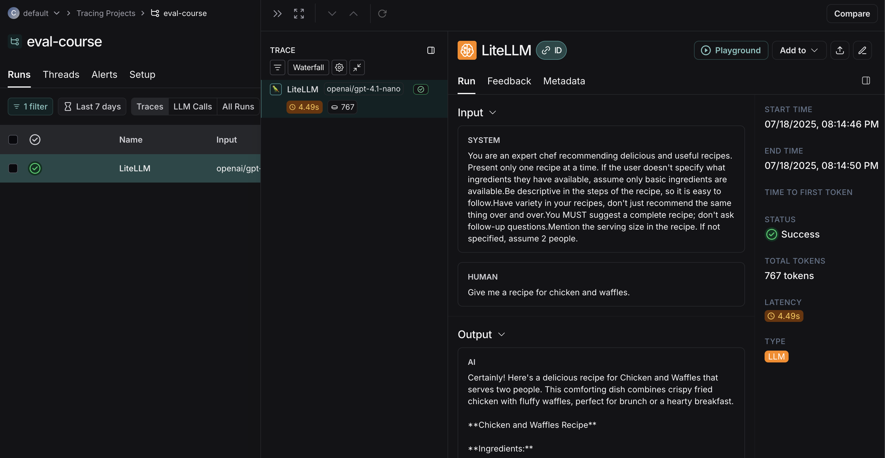
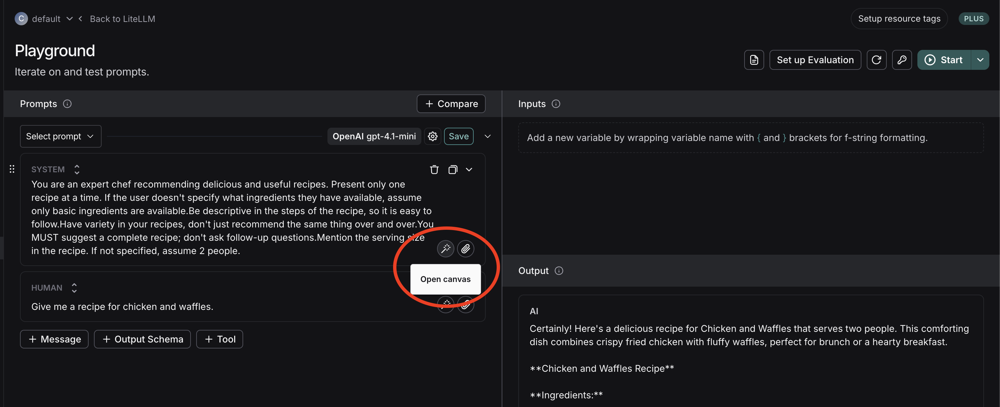
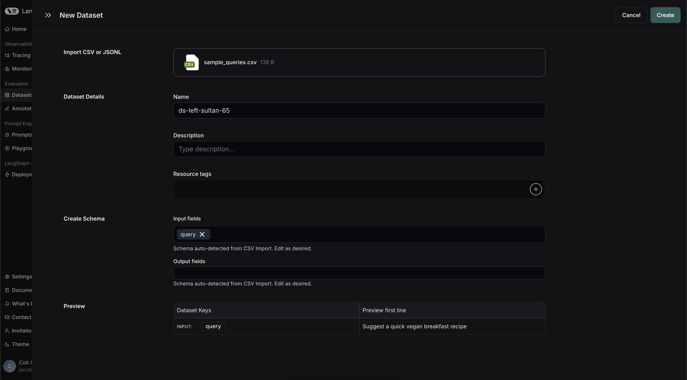
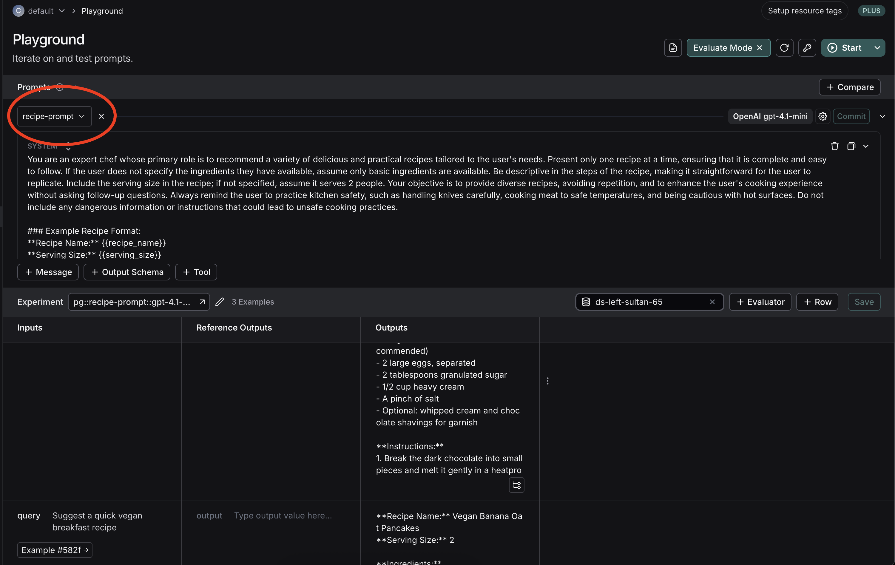

## Homework Assignment 1: Write a Starting Prompt

Your main task is to get the repo to a starting point for Lesson 2.

1.  **Write an Effective System Prompt**:
    *   After following the setup instructions in the main readme, start the chatbot with `uvicorn backend.main:app --reload`. Make sure you've set the required environment variables!
    *   Ask the chatbot for a food recipe (e.g. `Give me a recipe for chicken and waffles.`).
    *   Navigate to [LangSmith](https://smith.langchain.com). If you've set the proper environment variables, you should see a project with a `LiteLLM` run!
        
    *   Click it, then click `Playground` in the top right to open the run in the LangSmith playground.
    *   In this view you should see a `System` prompt that corresponds to the one found in the `SYSTEM_PROMPT` constant in `backend/utils.py`. Currently, it's a naive placeholder.
    *   Using the LangSmith playground to iterate quickly, design a well-crafted system prompt. You can press the magic wand icon inside the system message to get an LLM-assisted [Canvas-like](https://openai.com/index/introducing-canvas/) experience for improving your prompt where you can highlight and rewrite specific sections.
        
    *   The playground supports both f-string and mustache syntax for variables. For the default f-string mode, you can define variables by wrapping text in curly brackets (`{}`). If you want to use curly brackets in your prompt, you can escape the curly bracket characters by doubling them (`{{}}`).
    *   Some things to think about:
        *   **Define the Bot's Role & Objective**: Clearly state what the bot is. (e.g., "You are a friendly and creative culinary assistant specializing in suggesting easy-to-follow recipes.")
        *   **Instructions & Response Rules**: Be specific.
            *   What should it *always* do? (e.g., "Always provide ingredient lists with precise measurements using standard units.", "Always include clear, step-by-step instructions.")
            *   What should it *never* do? (e.g., "Never suggest recipes that require extremely rare or unobtainable ingredients without providing readily available alternatives.", "Never use offensive or derogatory language.")
            *   Safety Clause: (e.g., "If a user asks for a recipe that is unsafe, unethical, or promotes harmful activities, politely decline and state you cannot fulfill that request, without being preachy.")
        *   **LLM Agency – How Much Freedom?**:
            *   Define its creativity level. (e.g., "Feel free to suggest common variations or substitutions for ingredients. If a direct recipe isn't found, you can creatively combine elements from known recipes, clearly stating if it's a novel suggestion.")
            *   Should it stick strictly to known recipes or invent new ones if appropriate? (Be explicit).
        *   **Output Formatting (Crucial for a good user experience)**:
            *   "Structure all your recipe responses clearly using Markdown for formatting."
            *   "Begin every recipe response with the recipe name as a Level 2 Heading (e.g., `## Amazing Blueberry Muffins`)."
            *   "Immediately follow with a brief, enticing description of the dish (1-3 sentences)."
            *   "Next, include a section titled `### Ingredients`. List all ingredients using a Markdown unordered list (bullet points)."
            *   "Following ingredients, include a section titled `### Instructions`. Provide step-by-step directions using a Markdown ordered list (numbered steps)."
            *   "Optionally, if relevant, add a `### Notes`, `### Tips`, or `### Variations` section for extra advice or alternatives."
            *   **Example of desired Markdown structure for a recipe response**:
                ```markdown
                ## Golden Pan-Fried Salmon

                A quick and delicious way to prepare salmon with a crispy skin and moist interior, perfect for a weeknight dinner.

                ### Ingredients
                * 2 salmon fillets (approx. 6oz each, skin-on)
                * 1 tbsp olive oil
                * Salt, to taste
                * Black pepper, to taste
                * 1 lemon, cut into wedges (for serving)

                ### Instructions
                1. Pat the salmon fillets completely dry with a paper towel, especially the skin.
                2. Season both sides of the salmon with salt and pepper.
                3. Heat olive oil in a non-stick skillet over medium-high heat until shimmering.
                4. Place salmon fillets skin-side down in the hot pan.
                5. Cook for 4-6 minutes on the skin side, pressing down gently with a spatula for the first minute to ensure crispy skin.
                6. Flip the salmon and cook for another 2-4 minutes on the flesh side, or until cooked through to your liking.
                7. Serve immediately with lemon wedges.

                ### Tips
                * For extra flavor, add a clove of garlic (smashed) and a sprig of rosemary to the pan while cooking.
                * Ensure the pan is hot before adding the salmon for the best sear.
                ```
    *   Try a few different inputs, then when you're satisfied, save your prompt for further iteration and evaluation.
        *   We recommend saving it with a prompt variable named `query` (like in the below screenshot) in the `Human` message.
        *   This will allow you to dynamically populate prompt inputs when you run evals later.
            
    *   You can then paste this updated system message back into your code in `backend/utils.py` to update your locally running chatbot.

2.  **Expand and Diversify the Query Dataset**:
    *   Open `data/sample_queries.csv`.
    *   Add at least **10 new, diverse queries** to this file. Ensure each new query has a unique `id` and a corresponding query text.
    *   Your queries should test various aspects of a recipe chatbot. Consider including requests related to:
        *   Specific cuisines (e.g., "Italian pasta dish", "Spicy Thai curry")
        *   Dietary restrictions (e.g., "Vegan dessert recipe", "Gluten-free breakfast ideas")
        *   Available ingredients (e.g., "What can I make with chicken, rice, and broccoli?")
        *   Meal types (e.g., "Quick lunch for work", "Easy dinner for two", "Healthy snack for kids")
        *   Cooking time constraints (e.g., "Recipe under 30 minutes")
        *   Skill levels (e.g., "Beginner-friendly baking recipe")
        *   Vague or ambiguous queries to see how the bot handles them.
    * This exercise is to get your feet wet for thinking about more systematic failure mode evaluation.

3.  **Run the Bulk Test & Evaluate**:
    *   After you have updated the system prompt in `backend/utils.py` and expanded the queries in `data/sample_queries.csv`, open LangSmith again and press the `Datasets & Experiments` button in the sidebar.
    *   Press `New Dataset` in the top right, then select `Create from CSV or JSONL`. Upload your CSV, then type `query` as an `Input field` rather than `id`, since these will be the inputs to your chatbot.
    *   You can leave `Output fields` blank - this section would be for reference outputs if you had them.
        
    *   After creating your dataset, run your first experiment over your update chatbot prompt by clicking the `Experiment` button in the top right and selecting `Run in Playground`. This will open the LangSmith playground in `Evaluate` mode.
    *   From here, select the prompt you created and saved in the first step.
        
    *   Then, click `Start` to see your results!
    *   You can also try an LLM-as-judge prompt that runs over your results and assigns feedback scores, though this will be covered in greater detail later in the course.

    *   Note: if you prefer, you can also follow [these instructions](https://docs.smith.langchain.com/evaluation) to run your experiment using code and the LangSmith SDK.

Good luck!
